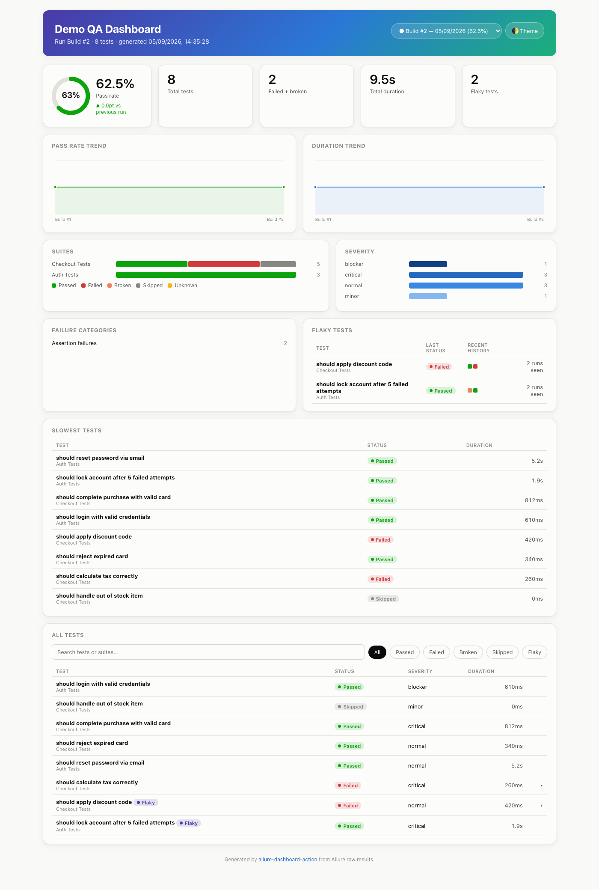

# Allure Dashboard Action

A GitHub Action that turns raw [Allure](https://allurereport.org/) test results into a
creative, trend-aware static dashboard — ready to publish straight to GitHub Pages.
Drop it into any workflow that produces an `allure-results/` directory (pytest, JUnit,
TestNG, Cypress, Playwright, RSpec, …) — no server, no database, no build step.



Unlike the default `allure generate` HTML report, this dashboard is built to be looked
at every day: pass-rate and duration trend lines across builds, a flaky-test tracker
with per-run history strips, suite/severity breakdowns, failure categorization, and a
searchable, filterable test explorer — light and dark mode included.

## Quick start

```yaml
- name: Run tests
  run: pytest --alluredir=allure-results

- name: Generate Allure dashboard
  uses: pranesh517/allure_dashboards@v1
  with:
    allure-results-path: allure-results

- uses: actions/upload-pages-artifact@v3
  with:
    path: allure-dashboard

- uses: actions/deploy-pages@v4
```

That's the minimum. For trend charts and flaky-test detection across builds (the
interesting part), you need to persist the `data/` directory between runs — see a
complete workflow using `actions/cache` for your stack:

- [examples/pytest-workflow.yml](examples/pytest-workflow.yml) — Python / pytest / allure-pytest
- [examples/testng-workflow.yml](examples/testng-workflow.yml) — Java / TestNG / Maven / allure-testng
- [examples/cypress-workflow.yml](examples/cypress-workflow.yml) — Node.js / Cypress / cypress-allure-plugin
- [examples/basic-workflow.yml](examples/basic-workflow.yml) — generic template + minimum-pass-rate gate

The action itself doesn't care which of these produced `allure-results/` — Allure's
raw-results JSON is one language-agnostic format shared by every official adapter
(`allure-java`, `allure-js`, `allure-python`, `allure-dotnet`, `allure-ruby`), so
anything that writes that format works, not just what's listed above.

Full permissions your job needs for the Pages deploy:

```yaml
permissions:
  contents: read
  pages: write
  id-token: write
```

## How it works

1. Your test framework's Allure adapter writes raw `*-result.json` files (and
   optionally `categories.json`) to `allure-results/` — this is the same input
   `allure generate` consumes, produced *before* that step, not its HTML output.
2. This action's `src/process.mjs` reads those files directly (zero npm
   dependencies — nothing to `npm install` on your runner) and aggregates them:
   status counts, suite/severity breakdowns, failure categorization, slowest
   tests, and — by diffing each test's `historyId` against what you pass via
   `history-path` — flaky-test detection.
3. It copies the static dashboard (`site-template/`) into `output-path` alongside
   the generated `data/*.json`, ready to upload as a Pages artifact.

Nothing here requires Java or the `allure` CLI — this reads the raw JSON Allure
adapters already produce, it doesn't wrap `allure generate`.

### Persisting history across runs

Each run only sees the results from that run. To get trend lines and flaky
detection, pass last run's `data/` directory back in via `history-path` — the
examples use `actions/cache` keyed by branch + run id (a fresh key every run, so
the cache's post-job save always fires) with a branch-prefixed `restore-keys` to
pick up the latest one. A `gh-pages` branch or artifact works too, if you'd
rather not use the cache.

### Flaky detection

A test is flagged flaky when its status flips between consecutive observations
for the same `historyId` (Allure's stable per-test identity, derived from its
full name + parameters) — passed→failed, broken→passed, etc., skipped excluded.
Observations are also recorded when the *same* run contains multiple result
files for one `historyId` (a retry within one run), so retries surface as
flakiness too. If you see more tests flagged than expected, check whether
`allure-results/` was cleared before the run (`pytest --clean-alluredir` or
equivalent) — leftover files from a previous local run count as extra
observations.

### Browsing previous runs

The dashboard isn't just "latest run + trend lines" — every run's full detail
(not just its rollup counts) is kept as `data/runs/<run-id>.json`, up to
`max-history` runs, and the run picker in the header lets you jump back to any
of them and see that run's suites, categories, flaky tests, and full test list,
not just its pass rate.

## Inputs

| Name | Required | Default | Description |
|---|---|---|---|
| `allure-results-path` | yes | — | Path to the raw `allure-results/` directory. |
| `output-path` | no | `allure-dashboard` | Where to write the generated site. |
| `history-path` | no | *(none)* | Path to a previous run's `data/` directory to merge trend/flaky history from. |
| `run-id` | no | `github.run_id` | Unique id for this run (the history key). |
| `run-label` | no | `github.run_number` | Human label shown on the dashboard. |
| `max-history` | no | `100` | Max runs kept in trend history. |
| `dashboard-title` | no | `Allure Dashboard` | Title shown on the dashboard. |

## Outputs

| Name | Description |
|---|---|
| `total`, `passed`, `failed`, `broken`, `skipped` | Counts for this run. |
| `pass-rate` | Pass rate percentage (0–100). |
| `flaky-count` | Number of tests flagged flaky this run. |
| `site-path` | Path to the generated site (same as `output-path`). |

Use these to gate the build (`if: steps.dashboard.outputs.pass-rate < 80`) or post
a summary — see the examples.

## Local development

```bash
node src/process.mjs \
  --results examples/sample-allure-results/run1 \
  --output /tmp/dash-out \
  --site-template site-template \
  --run-id local-1 --run-label "Local run"

npx serve /tmp/dash-out   # or: python3 -m http.server -d /tmp/dash-out
```

`.github/workflows/test-action.yml` runs the action against the bundled two-run
fixture (`examples/sample-allure-results/`) on every push and PR, asserts the
output, and republishes the result as this repo's own live GitHub Pages demo on
`main` — so the demo you see is exactly what running the action produces, not a
hand-crafted mockup.

## License

MIT — see [LICENSE](LICENSE).
