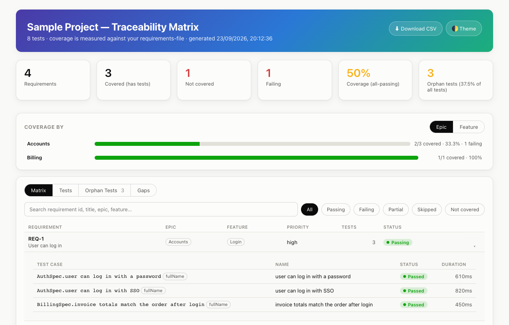

# Allure Traceability Matrix

An optional companion to [Allure Dashboard](../README.md) (`pranesh517/allure_dashboards`),
but usable entirely on its own. It reads raw [Allure](https://allurereport.org/)
results and produces a static, GitHub-Pages-ready **requirements traceability
matrix**: which requirements, epics and features are covered by which tests,
what those tests' latest status is, which requirements have no tests at all,
and which tests have no requirement at all ("orphan tests").

It's a separate action from the dashboard, referenced as its own workflow
step — `pranesh517/allure_dashboards/traceability@v2` — so using it is
opt-in. Nothing about it runs, and nothing changes, unless you add that step.



Same zero-dependency, no-server, no-database approach as the dashboard: this
reads the raw `*-result.json` files directly, no `allure` CLI or `allure
generate` step.

## Quick start

```yaml
- name: Run tests
  run: pytest --alluredir=allure-results

- name: Generate traceability matrix
  id: matrix
  uses: pranesh517/allure_dashboards/traceability@v2
  with:
    allure-results-path: allure-results
    requirement-annotation: requirement

- uses: actions/upload-pages-artifact@v3
  with:
    path: ${{ steps.matrix.outputs.site-path }}

- uses: actions/deploy-pages@v4
```

That's the minimum — it measures coverage against whatever requirement ids
show up in your test results. To measure against a full list of requirements
(so one with zero tests shows up as **not covered** instead of being invisible),
add `requirements-file: requirements.csv`. See a complete workflow:

- [examples/basic-workflow.yml](examples/basic-workflow.yml) — standalone
- [examples/with-dashboard-workflow.yml](examples/with-dashboard-workflow.yml) — alongside the Allure Dashboard action, one combined Pages site, tests link back to their dashboard row
- [examples/annotations-pytest.md](examples/annotations-pytest.md), [-testng.md](examples/annotations-testng.md), [-cypress-playwright.md](examples/annotations-cypress-playwright.md) — how to record requirement/test-case ids in each framework
- [examples/requirements.csv](examples/requirements.csv) + [examples/sample-allure-results/](examples/sample-allure-results/) — the fixture this action's own tests run against

Permissions your job needs for the Pages deploy (same as the dashboard action):

```yaml
permissions:
  contents: read
  pages: write
  id-token: write
```

## How annotations map to Allure

Allure results carry ids in two shapes: **labels** (`{name, value}`, can
repeat) and **links** (`{name, url, type}`). `requirement-annotation` /
`testcase-annotation` is a name you choose; `requirement-source` /
`testcase-source` says where to look for it:

| `*-source` | Where it looks | Matches when |
|---|---|---|
| `auto` (default) | labels **and** links, unioned | a label named `*-annotation`, or a link whose `type` equals it |
| `label` | labels only | a label named `*-annotation` |
| `link` | links only | a link whose `type` equals `*-annotation` |
| `tag` | the Allure `tag` label | any tag value — filtered down to real ids by `*-id-pattern`, which is effectively required with this source |

A link's id is its `name` (e.g. `@TmsLink("TC-1")`'s visible label) if set,
else the last path segment of its `url`.

Common annotation names by adapter (see the `examples/annotations-*.md`
files for the actual code):

| Framework | Requirement (custom label) | Test case (link) | Requirement-as-issue (link) |
|---|---|---|---|
| pytest (`allure-pytest`) | `@allure.label("requirement", "REQ-1")` → `requirement-annotation: requirement` | `@allure.testcase(url, "TC-1")` → type `test_case` | `@allure.issue(url, "BUG-1")` → type `issue` |
| Java/TestNG (`allure-testng`) | `Allure.label("requirement", "REQ-1")` → `requirement-annotation: requirement` | `@TmsLink("TC-1")` → type `tms` | `@Issue("BUG-1")` → type `issue` |
| Cypress / Playwright | `allure.label("requirement", "REQ-1")` / `cy.allure().label(...)` → `requirement-annotation: requirement` | `.tms("TC-1", url)` → type `tms` | `.issue("BUG-1", url)` → type `issue` |

Ids are matched **case-insensitively** everywhere (a test's `req-1` and a
`requirements-file` row's `REQ-1` are the same requirement); the
`requirements-file`'s casing wins for display when both exist.

`requirement-id-pattern` / `testcase-id-pattern` (e.g. `REQ-\d+`) filters and
extracts from whatever the source produces — a capture group is used if the
pattern has one, else the whole match. A value that doesn't match isn't
dropped silently: it's reported in the **Gaps** tab. Patterns are compiled
case-insensitively by default; write one as `/pattern/flags` (e.g.
`/^REQ-\d+$/`) to opt into case-sensitive matching.

## How coverage is calculated

- **Denominator** (`total-requirements`): `requirements-file` row count if
  you gave one, else the count of distinct requirement ids found in the test
  results. The report states which mode it's in. A requirement id used by a
  test but missing from `requirements-file` doesn't inflate the denominator —
  it's listed separately as an **unknown requirement** in the Gaps tab.
- **Per-requirement status**: any linked test `failed`/`broken` → `failing`
  (outranks everything else); all linked tests `passed` → `passing`; all
  `skipped` → `skipped`; a mix of only `passed`+`skipped` → `partial`; no
  linked tests → `not-covered` (only possible with a `requirements-file`).
- **`covered-requirements`**: has at least one linked test, of *any* status —
  so a `failing` or `partial` requirement still counts as covered.
- **`coverage-percent`**: the stricter number — only `passing` requirements ÷
  total. A requirement that's covered but currently failing counts against
  this percentage even though it counts *for* `covered-requirements`.
- **Orphan tests**: tests with no requirement id at all (not even one that
  got filtered out by the pattern — that's a separate "ignored" bucket).
  Their own tab, ranked by severity then status, plus a KPI card with the
  rate (orphans ÷ all tests) — the point is to make "tests nobody asked for"
  visible, not just technically present in a CSV somewhere.
- **Retries**: Allure records a retry as a second result sharing the same
  `historyId`. The one with the later `stop`/`start` time is used; the retry
  count is tracked (`retriedTests` in `data/summary.json`) but doesn't create
  a duplicate row.

`traceability.csv` (written next to `index.html`, and linked from the
report's "Download CSV" button) has one row per requirement/test pair, plus
one row for each not-covered requirement (blank test columns) and each
orphan test (blank requirement columns) — every requirement and every test
appears at least once, not just the pairs that exist.

## Epic / feature / story vs. requirement coverage

If your tests carry Allure's own `@Epic`/`@Feature`/`@Story` labels (most
adapters' equivalent of TestNG's `@Epic`, pytest's `@allure.epic`, etc.), the
report gives you two different, complementary views of them — worth telling
apart, since they answer different questions:

- **"Test annotation coverage"** (top of the page): *how many tests are
  tagged at all*, independent of whether that tag maps to anything in a
  requirements-file. For each of Epic, Feature, Story, and whatever
  `requirement-annotation` is configured to, it's a straight count — X of Y
  tests carry that annotation. A low number here means tests aren't being
  tagged, not that requirements are uncovered; it's a different problem from
  everything else on the page. The requirement row is measured the same way
  the rest of the report measures requirement tracing (respecting
  `requirement-source`/`requirement-id-pattern`), the epic/feature/story rows
  are always read as plain Allure labels (there's no `epic-source` input —
  Allure itself defines them as labels, never links).
- **"Coverage by"** (Epic / Feature / Story tabs, below it): the *existing*
  requirement-coverage numbers (same `not-covered`/`failing`/`passing`
  definitions as everywhere else on the page), just grouped by epic, feature,
  or story instead of listed flat. A requirement's group comes from that
  column in `requirements-file` if you gave one with that column; otherwise
  from the union of that label's values across the requirement's own
  covering tests. Click a bar to filter the Matrix tab to it.

So "Story: 6 of 8 tests (75%)" in the first card and the five story buckets
in the second are counting different things — one is about test tagging
hygiene, the other is requirement coverage sliced by story. Both are in
`data/summary.json` (`annotationCoverage`, `byEpic`, `byFeature`, `byStory`)
if you want to consume them directly instead of via the page.

## No dedicated requirement id? Point it at epic, feature, or story

`requirement-annotation` is required, but a lot of suites don't have a
formal requirement/ticket id on every test — only Allure's own
`@Epic`/`@Feature`/`@Story`. That's fine: point `requirement-annotation` at
whichever of those is the closest thing you have to a traceable unit (a
Feature usually maps to a requirement better than an Epic — an Epic tends to
be a whole theme, e.g. "Checkout", where a Feature is closer to one
requirement, e.g. "Guest checkout"). Everything else on the page still
works, with a few things worth expecting to be different:

```yaml
requirement-annotation: feature   # or: epic / story — whichever fits your suite
requirement-source: label         # epic/feature/story are always plain labels, never links
# no requirement-id-pattern — their values are free text, not a fixed id format
# no requirements-file, unless you maintain one — coverage is then measured
# against whichever feature values actually show up in your results
```

| | With a real requirement id (custom label, `@TmsLink`, `@Issue`, a matching tag) | With `requirement-annotation` pointed at epic/feature/story |
|---|---|---|
| Matrix rows | Your requirement ids/ticket numbers | The epic/feature/story values themselves — a Feature *is* the requirement here |
| `not-covered` | Real, once you add a `requirements-file` — a requirement with zero tests shows up | Effectively never on its own: without a master list, every row in the matrix came from at least one test by construction. Add a `requirements-file` (id = your feature names) to get real not-covered detection anyway |
| Orphan tests / Gaps | Tests with no formal id at all — usually the smaller, more actionable group | Tests with no `@Epic`/`@Feature`/`@Story` — often larger, since a lot of suites tag inconsistently at first |
| "Test annotation coverage" | Epic/Feature/Story all shown separately from the Requirement row | The fixed row matching your choice is dropped (no duplicate "Feature" shown twice) |
| "Coverage by" Epic/Feature/Story tabs | A genuinely different, useful cross-cut — e.g. "which epics have failing requirements" | Still useful, but one tab now restates the Matrix (e.g. "Coverage by Feature" when `requirement-annotation: feature`); the *other* two (Epic, Story) are where the new information is |
| Matrix's own Epic/Feature columns | From `requirements-file`'s columns if you gave one | Resolved from the covering tests' own labels — so a Feature-as-requirement row still shows its real Epic, not "—" |

None of this is a one-way door: add a real requirement id system later (Jira,
TestRail, a `@Requirement` label your team defines) and just repoint
`requirement-annotation` at it — Epic/Feature/Story keep working exactly as
they did before, as their own "Coverage by" tabs and annotation-coverage
rows, independent of whatever the requirement id turns out to be.

## Inputs

| Input | Required | Default | Meaning |
|---|---|---|---|
| `allure-results-path` | yes | | Path to the raw `allure-results/` directory. |
| `requirement-annotation` | yes | | The label name / link type that holds a requirement id. |
| `requirement-source` | no | `auto` | `auto`, `label`, `link`, or `tag`. |
| `requirement-id-pattern` | no | *(none)* | Regex to extract/validate requirement ids. With `tag` source, this is what selects which tags are requirement ids. |
| `testcase-annotation` | no | *(none)* | The label name / link type that holds a test case id. Falls back to the test's `fullName` when unset or missing on a given test. |
| `testcase-source` | no | `auto` | Same values as `requirement-source`. |
| `testcase-id-pattern` | no | *(none)* | Same idea as `requirement-id-pattern`, for test case ids. |
| `requirements-file` | no | *(none)* | CSV or JSON master list of requirements. Columns/keys: `id` (required), `title`, `epic`, `feature`, `priority` (all optional, case-insensitive). Without this, coverage is measured against ids found in results, and nothing can be "not covered". |
| `output-path` | no | `traceability-report` | Where the static site and data are written. |
| `dashboard-url` | no | *(none)* | Base URL of an Allure Dashboard site from the same run. When set, every test in the matrix links to that test in the dashboard (the dashboard reads a `#test=<historyId>` hash to jump straight to it). |
| `title` | no | `Traceability Matrix` | Title shown on the report. |
| `min-coverage` | no | *(none)* | 0–100. Fails the step (after still writing the report) if `coverage-percent` is lower. |
| `fail-on-uncovered` | no | `false` | Fails the step if any requirement has zero tests. |
| `fail-on-failing` | no | `false` | Fails the step if any requirement has a failing/broken linked test. |

## Outputs

| Output | Meaning |
|---|---|
| `total-requirements`, `covered-requirements`, `uncovered-requirements`, `failing-requirements` | See "How coverage is calculated" above. |
| `coverage-percent` | All-passing requirements ÷ total, one decimal place. |
| `orphan-tests` | Count of tests with no requirement id at all. |
| `site-path` | Path to the generated site — upload this with `actions/upload-pages-artifact`. |

## Local development

No install step — zero dependencies, plain Node ES modules:

```bash
cd traceability
npm test        # node:test, 66 cases, no fixtures on disk needed for these

node src/process.mjs \
  --results examples/sample-allure-results \
  --output /tmp/matrix-out \
  --requirement-annotation requirement \
  --requirements-file examples/requirements.csv \
  --site-template site-template \
  --title "Local run"

npx serve /tmp/matrix-out   # or: python3 -m http.server -d /tmp/matrix-out
```

Try `--requirement-annotation issue --requirement-source link` against the
same fixture — `examples/sample-allure-results` includes two tests linked to
the same `@Issue`-style `BUG-501`, to demonstrate the link-sourced path.

## License

MIT — see [../LICENSE](../LICENSE).
